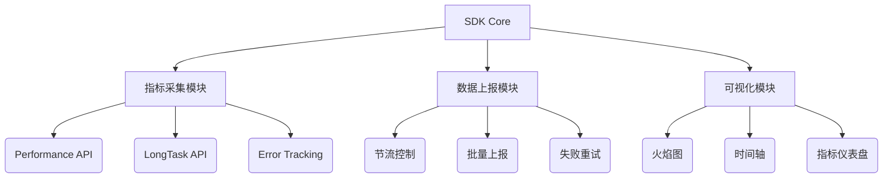
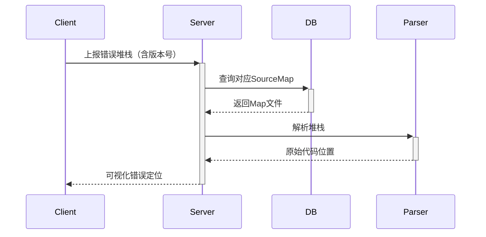

# 前端性能监控SDK实现方案

## 一、系统架构设计



## 二、核心模块实现

### 1、指标采集模块

```javascript
class PerformanceCollector {
  constructor() {
    this.webVitals = {
      FP: null,
      FCP: null,
      LCP: null,
      CLS: 0,
      FID: null
    };
  }

  init() {
    const po = new PerformanceObserver((list) => {
      for (const entry of list.getEntries()) {
        switch(entry.entryType) {
          case 'paint':
            this._handlePaintMetrics(entry);
            break;
          case 'largest-contentful-paint':
            this.webVitals.LCP = entry.startTime;
            break;
          // ...其他指标处理
        }
      }
    });
    po.observe({entryTypes: ['paint', 'largest-contentful-paint']});
  }

  _handlePaintMetrics(entry) {
    if(entry.name === 'first-paint') {
      this.webVitals.FP = entry.startTime;
    } else if(entry.name === 'first-contentful-paint') {
      this.webVitals.FCP = entry.startTime;
    }
  }
}
```

### 2、LongTask监控

```javascript
const longTaskObserver = new PerformanceObserver((list) => {
  const tasks = list.getEntries().map(task => ({
    startTime: task.startTime,
    duration: task.duration,
    container: task.attribution[0]?.container || 'window'
  }));
  SDK.report({ type: 'longtask', data: tasks });
});
longTaskObserver.observe({entryTypes: ['longtask']});
```

### 3、SourceMap解析流程



### 4、火焰图实现（D3.js核心逻辑

```javascript
function renderFlamegraph(data) {
  const root = d3.hierarchy(data);
  const svg = d3.select("#chart").append("svg");

  const flameLayout = d3.flame()
    .size([width, height])
    .sort((a, b) => b.value - a.value);

  svg.datum(root)
     .call(flameLayout);
}
```

## 三、技术文档设计

### 前端性能监控SDK技术文档

#### 1、安装指南

```bash
# NPM
npm install @perf-sdk/core

# CDN
<script src="https://cdn.example.com/sdk/v1.min.js"></script>
```

#### 2、快速开始

```javascript
import PerfSDK from '@perf-sdk/core';

PerfSDK.init({
  appId: 'YOUR_APP_ID',
  reportUrl: 'https://api.example.com/log',
  sampleRate: 0.3,
  plugins: [WebVitalsPlugin, LongTaskPlugin]
});
```

#### 3、配置参数

| 参数           | 类型    | 默认值 | 说明                 |
| -------------- | ------- | ------ | -------------------- |
| captureError   | boolean | true   | 是否捕获JS错误       |
| maxBreadcrumbs | number  | 20     | 用户行为轨迹记录数量 |
| sessionTimeout | number  | 30     | 会话超时时间（分钟） |

#### 4、API参考

##### 4.1 手动埋点

```javascript
PerfSDK.addBreadcrumb({
  type: 'user',
  message: '点击购买按钮',
  timestamp: Date.now()
});
```

##### 4.2 性能指标订阅

```javascript
const unsubscribe = PerfSDK.subscribe('LCP', (metric) => {
  console.log('LCP:', metric.value);
});
```

#### 5、构建优化方案

```javascript
// rollup.config.js
export default {
  input: 'src/index.js',
  output: {
    file: 'dist/sdk.min.js',
    format: 'iife',
    compact: true,
    plugins: [terser({
      mangle: {
        keep_fnames: /^capture/
      }
    })]
  }
};
```

#### 6. 错误映射示例

- 原始错误：

```text
at <http://example.com/app.min.js:1:23456>
```

- 解析后：

```text
at src/components/Button.tsx:12:34
```

#### 7. 性能数据格式

```json
{
  "metric": "FCP",
  "value": 1234,
  "tags": {
    "os": "Android",
    "browser": "Chrome/91",
    "device": "Mobile"
  },
  "timeline": [
    { "type": "dom", "time": 300 },
    { "type": "load", "time": 1500 }
  ]
}
```

#### 8. 最佳实践

##### 1. 在Webpack构建流程中添加SourceMap上传插件

```javascript
// webpack.config.js
const PerfSourceMapPlugin = require('@perf-sdk/webpack-plugin');

module.exports = {
  plugins: [
    new PerfSourceMapPlugin({
      appVersion: process.env.APP_VERSION
    })
  ]
};
```

#### 2. 异常处理建议

```javascript
window.addEventListener('unhandledrejection', (e) => {
  PerfSDK.captureException(e.reason);
});
```

### 实现路线图

1. **基础指标采集（2周）**
    - 完成Performance API集成
    - 实现数据上报队列
1. **可视化模块（1周）**
    - 火焰图渲染核心
    - 性能仪表盘开发
1. **生产环境适配（1周）**
    - Webpack/Rollup插件开发
    - 错误边界处理
1. **测试验证（1周）**
    - 编写Cypress测试用例
    - 压力测试（模拟10万次上报）

### 特别注意的技术风险

- PerformanceObserver在不同浏览器的兼容性问题
- SourceMap文件的安全存储问题
- 大数据量上报时的内存控制

### 建议的测试策略

- 使用Puppeteer录制用户操作路径
- 使用Lighthouse生成性能基线
- 对比Sentry/Google Analytics的数据一致性
