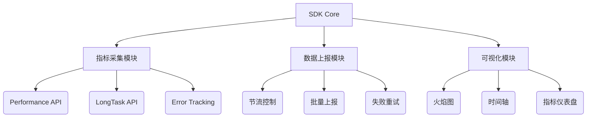
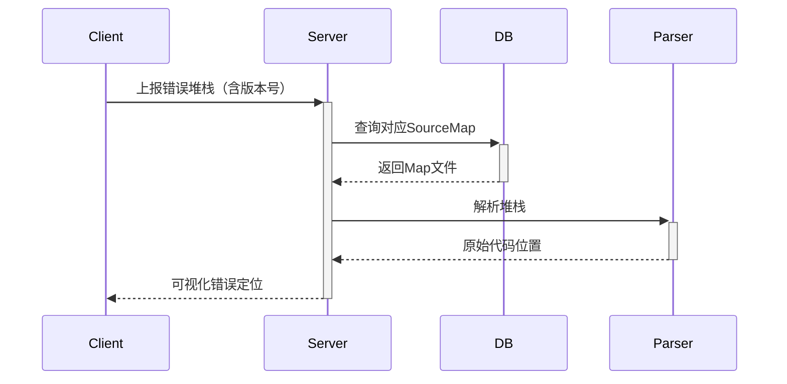

# 前端性能监控SDK实现方案

## 一、系统架构设计



## 二、核心模块实现

### 1、指标采集模块

```javascript
class PerformanceCollector {
  constructor() {
    this.webVitals = {
      FP: null,
      FCP: null,
      LCP: null,
      CLS: 0,
      FID: null
    };
  }

  init() {
    const po = new PerformanceObserver((list) => {
      for (const entry of list.getEntries()) {
        switch(entry.entryType) {
          case 'paint':
            this._handlePaintMetrics(entry);
            break;
          case 'largest-contentful-paint':
            this.webVitals.LCP = entry.startTime;
            break;
          // ...其他指标处理
        }
      }
    });
    po.observe({entryTypes: ['paint', 'largest-contentful-paint']});
  }

  _handlePaintMetrics(entry) {
    if(entry.name === 'first-paint') {
      this.webVitals.FP = entry.startTime;
    } else if(entry.name === 'first-contentful-paint') {
      this.webVitals.FCP = entry.startTime;
    }
  }
}
```

### 2、LongTask监控

```javascript
const longTaskObserver = new PerformanceObserver((list) => {
  const tasks = list.getEntries().map(task => ({
    startTime: task.startTime,
    duration: task.duration,
    container: task.attribution[0]?.container || 'window'
  }));
  SDK.report({ type: 'longtask', data: tasks });
});
longTaskObserver.observe({entryTypes: ['longtask']});
```

### 3、SourceMap解析流程



### 4、火焰图实现（D3.js核心逻辑

```javascript
function renderFlamegraph(data) {
  const root = d3.hierarchy(data);
  const svg = d3.select("#chart").append("svg");

  const flameLayout = d3.flame()
    .size([width, height])
    .sort((a, b) => b.value - a.value);

  svg.datum(root)
     .call(flameLayout);
}
```

### 5、后续加强方向

实现性能数据异常检测算法
开发Chrome插件调试工具
添加Web Vitals 3.0指标支持
构建性能基准对比系统

增加"集成指南"章节：
React/Vue框架适配方案
微前端架构集成方案
服务端渲染（SSR）注意事项

## 三、技术文档设计

### 前端性能监控SDK技术文档

#### 1、安装指南

```bash
# NPM
npm install @perf-sdk/core

# CDN
<script src="https://cdn.example.com/sdk/v1.min.js"></script>
```

#### 2、快速开始

```javascript
import PerfSDK from '@perf-sdk/core';

PerfSDK.init({
  appId: 'YOUR_APP_ID',
  reportUrl: 'https://api.example.com/log',
  sampleRate: 0.3,
  plugins: [WebVitalsPlugin, LongTaskPlugin]
});
```

#### 3、配置参数

| 参数           | 类型    | 默认值 | 说明                 |
| -------------- | ------- | ------ | -------------------- |
| captureError   | boolean | true   | 是否捕获JS错误       |
| maxBreadcrumbs | number  | 20     | 用户行为轨迹记录数量 |
| sessionTimeout | number  | 30     | 会话超时时间（分钟） |

#### 4、API参考

##### 4.1 手动埋点

```javascript
PerfSDK.addBreadcrumb({
  type: 'user',
  message: '点击购买按钮',
  timestamp: Date.now()
});
```

##### 4.2 性能指标订阅

```javascript
const unsubscribe = PerfSDK.subscribe('LCP', (metric) => {
  console.log('LCP:', metric.value);
});
```

#### 5、构建优化方案

```javascript
// rollup.config.js
export default {
  input: 'src/index.js',
  output: {
    file: 'dist/sdk.min.js',
    format: 'iife',
    compact: true,
    plugins: [terser({
      mangle: {
        keep_fnames: /^capture/
      }
    })]
  }
};
```

#### 6. 错误映射示例

- 原始错误：

```text
at <http://example.com/app.min.js:1:23456>
```

- 解析后：

```text
at src/components/Button.tsx:12:34
```

#### 7. 性能数据格式

```json
{
  "metric": "FCP",
  "value": 1234,
  "tags": {
    "os": "Android",
    "browser": "Chrome/91",
    "device": "Mobile"
  },
  "timeline": [
    { "type": "dom", "time": 300 },
    { "type": "load", "time": 1500 }
  ]
}
```

#### 8. 最佳实践

##### 1. 在Webpack构建流程中添加SourceMap上传插件

```javascript
// webpack.config.js
const PerfSourceMapPlugin = require('@perf-sdk/webpack-plugin');

module.exports = {
  plugins: [
    new PerfSourceMapPlugin({
      appVersion: process.env.APP_VERSION
    })
  ]
};
```

#### 2. 异常处理建议

```javascript
window.addEventListener('unhandledrejection', (e) => {
  PerfSDK.captureException(e.reason);
});
```

## 目录结构设计

```text
PerfLite/
├── src/                           # TypeScript源代码
│   ├── core/                      # 核心监控逻辑
│   │   ├── index.ts               # 导出核心模块
│   │   ├── error-parser.ts        # 错误解析器
│   │   ├── performance-analyzer.ts # 性能分析器
│   │   ├── visualization.ts       # 可视化引擎
│   │   └── api-counter.ts         # API计数器
│   ├── parser/                    # 解析器模块
│   │   ├── index.ts               # 导出解析器
│   │   ├── wasm/                  # WASM本地解析器
│   │   │   ├── index.ts           # WASM封装
│   │   │   └── loader.ts          # WASM加载器
│   │   └── deepseek/              # 智能API调用
│   │       ├── index.ts           # DeepSeek封装
│   │       └── client.ts          # API客户端
│   ├── cache/                     # 缓存系统
│   │   ├── index.ts               # 导出缓存系统
│   │   ├── memory.ts              # 内存缓存实现
│   │   └── storage.ts             # 持久化存储实现
│   ├── visualization/             # 可视化引擎
│   │   ├── index.ts               # 导出可视化模块
│   │   ├── dashboard.ts           # 仪表盘实现
│   │   ├── chart-adapter.ts       # 图表适配器
│   │   └── renderers/             # 渲染器
│   │       ├── webgl.ts           # WebGL渲染器
│   │       └── canvas.ts          # Canvas渲染器
│   ├── plugins/                   # 插件系统
│   │   ├── index.ts               # 插件管理器
│   │   ├── interface.ts           # 插件接口定义
│   │   └── built-in/              # 内置插件
│   │       ├── memory-monitor.ts  # 内存监控插件
│   │       └── react-profiler.ts  # React性能分析插件
│   ├── utils/                     # 工具函数
│   │   ├── index.ts               # 导出工具函数
│   │   ├── cache.ts               # 缓存工具
│   │   ├── sanitize.ts            # 数据脱敏工具
│   │   ├── compress.ts            # 压缩工具
│   │   └── browser.ts             # 浏览器兼容工具
│   ├── types/                     # 类型定义
│   │   ├── index.ts               # 导出所有类型
│   │   ├── error.ts               # 错误相关类型
│   │   ├── perf.ts                # 性能相关类型
│   │   └── config.ts              # 配置相关类型
│   └── index.ts                   # 入口文件
│
├── rust/                          # Rust WASM 源代码
│   ├── src/                       # Rust源码
│   │   ├── lib.rs                 # 入口文件
│   │   ├── parser.rs              # 解析器实现
│   │   ├── simd.rs                # SIMD优化实现
│   │   └── utils.rs               # 工具函数
│   ├── benches/                   # 性能基准测试
│   │   └── parser_benchmark.rs    # 解析器性能测试
│   ├── tests/                     # Rust单元测试
│   │   └── parser_tests.rs        # 解析器测试
│   ├── Cargo.toml                 # 依赖配置
│   └── build.sh                   # 构建脚本
│
├── tests/                         # TypeScript测试
│   ├── core/                      # 核心模块测试
│   │   ├── error-parser.test.ts   # 错误解析器测试
│   │   ├── performance-analyzer.test.ts # 性能分析器测试
│   │   └── visualization.test.ts  # 可视化引擎测试
│   ├── parser/                    # 解析器测试
│   │   ├── wasm.test.ts           # WASM解析器测试
│   │   └── deepseek.test.ts       # DeepSeek API测试
│   ├── cache/                     # 缓存系统测试
│   │   ├── memory.test.ts         # 内存缓存测试
│   │   └── storage.test.ts        # 持久化存储测试
│   ├── integration/               # 集成测试
│   │   ├── error-handling.test.ts # 错误处理测试
│   │   └── performance.test.ts    # 性能测试
│   └── e2e/                       # 端到端测试
│       ├── browser.test.ts        # 浏览器环境测试
│       └── visualization.test.ts  # 可视化功能测试
│
├── examples/                      # 示例代码
│   ├── basic/                     # 基础示例
│   │   ├── index.html             # 基础用法
│   │   └── basic.js               # 基础脚本
│   ├── advanced/                  # 进阶示例
│   │   ├── index.html             # 进阶用法
│   │   └── advanced.js            # 进阶脚本
│   ├── plugins/                   # 插件示例
│   │   ├── index.html             # 插件用法
│   │   └── custom-plugin.js       # 自定义插件
│   └── visualization/             # 可视化示例
│       ├── index.html             # 可视化用法
│       └── dashboard.js           # 仪表盘脚本
│
├── docs/                          # 项目文档
│   ├── api/                       # API文档
│   ├── guides/                    # 使用指南
│   └── design/                    # 设计文档
│
├── scripts/                       # 构建脚本
│   ├── build.js                   # 构建脚本
│   ├── wasm-build.js              # WASM构建脚本
│   └── release.js                 # 发布脚本
│
├── dist/                          # 构建输出目录
│   ├── perf-lite.js               # 非压缩版本
│   ├── perf-lite.min.js           # 压缩版本
│   └── wasm/                      # WASM构建产物
│
├── package.json                   # npm配置
├── tsconfig.json                  # TypeScript配置
├── webpack.config.js              # Webpack配置
├── Cargo.toml                     # Rust依赖配置
├── .gitignore                     # Git忽略文件
├── LICENSE                        # 许可证
└── README.md                      # 项目说明
```

### 实现路线图

1. **基础指标采集（2周）**
    - 完成Performance API集成
    - 实现数据上报队列
1. **可视化模块（1周）**
    - 火焰图渲染核心
    - 性能仪表盘开发
1. **生产环境适配（1周）**
    - Webpack/Rollup插件开发
    - 错误边界处理
1. **测试验证（1周）**
    - 编写Cypress测试用例
    - 压力测试（模拟10万次上报）

### 特别注意的技术风险

- PerformanceObserver在不同浏览器的兼容性问题
- SourceMap文件的安全存储问题
- 大数据量上报时的内存控制

### 建议的测试策略

- 使用Puppeteer录制用户操作路径
- 使用Lighthouse生成性能基线
- 对比Sentry/Google Analytics的数据一致性

### rust

使用ErrorParser类处理错误堆栈
支持SIMD加速
输出优化后的WASM文件

#### rust 工具链安装

```bash
# 傻瓜式一键安装
pnpm run setup
```

#### 验证安装

```bash
# 检查 Rust 版本
rustc --version

# 检查 wasm-pack 版本
wasm-pack --version

# 检查是否支持 wasm32 目标
rustup target list | grep wasm32

```

#### 编译

```bash
# 开发环境运行
pnpm run dev

# 生产环境构建
pnpm run build

# 构建WASM模块
pnpm run build:wasm

# 完整构建包含WASM
pnpm run build:all

# 分析包体积
pnpm run analyze
```

先完成代码编写:

完成 parser.rs 的基础实现
完成 lib.rs 的基础实现
编写基础测试用例
进行单元测试:

```bash
cargo test
```

后续再进行 WASM 编译:

```bash
# 编译命令 (之后再执行)
wasm-pack build src/wasm --target web

# 优化wasm体积
wasm-gc pkg/perflite_wasm_bg.wasm
```

先关注基础功能实现
确保测试通过
最后再考虑 SIMD 优化
编译时再处理 wasm 相关优化
